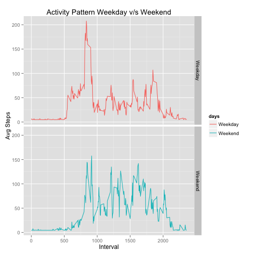

## Loading and preprocessing the data
Load the data from csv file and show top-5 entries.


```r
activity <- read.csv("activity.csv", na.strings = "NA")
head(activity)
```

```
##   steps       date interval
## 1    NA 2012-10-01        0
## 2    NA 2012-10-01        5
## 3    NA 2012-10-01       10
## 4    NA 2012-10-01       15
## 5    NA 2012-10-01       20
## 6    NA 2012-10-01       25
```


## What is mean total number of steps taken per day?
Here, we will show histogram plot of average steps taken per day and find the average and median of steps taken per day.


```r
library(dplyr)
library(ggplot2)

summary <- summarise(group_by(activity, date), total_steps = sum(steps, na.rm = TRUE))
# find average and median steps per day
avgSteps <- mean(summary$total_steps, na.rm = TRUE)
medianSteps <- median(summary$total_steps, na.rm = TRUE)
# plot histogram
hist(summary$total_steps, main = "Total Steps per Day", xlab = "Steps")
```

 

+ Average steps per day: 9354.23
+ Median steps per day : 10395


## What is the average daily activity pattern?
Find the daily activity pattern by plotting average daily steps at each interval.


```r
summary <- summarise(group_by(activity, interval), avg_steps = mean(steps, na.rm = TRUE))

with(summary, plot(interval, avg_steps, type = "l", xlab = "Interval", ylab = "Avg Steps", main = "Daily Activity Pattern"))
```

 

## Imputing missing values
Here, we will look at the quality of the data. 
If there are missing values, we will try to derive a strategy to fina values for missing data.
Our strategy is to use the median of the day / interval if steps are missing for a given interval.


```r
missingValues <- nrow(activity[is.na(activity$steps), ])
```
Total missing values in the dataset: 2304

Impute missing values here

```r
activity2 <- data.frame(activity)
missing <- is.na(activity2$steps)
activity2[missing, ]$steps <- as.integer(medianSteps / 288)
```

Show histogram plot of average steps taken per day and find the average and median of steps taken per day, using the new dataset which has missing values imputed.


```r
summary <- summarise(group_by(activity2, date), total_steps = sum(steps))
# find average and median steps per day
newAvgSteps <- mean(summary$total_steps)
newMedianSteps <- median(summary$total_steps)
# plot histogram
hist(summary$total_steps, main = "Total Steps per Day with Imputed Missing Data", xlab = "Steps")
```

 

+ Average steps per day with imputed missing data: 10713.97
+ Median steps per day with imputed missing data : 10395

+ Impact on average with imputed missing data: +1040.77


## Are there differences in activity patterns between weekdays and weekends?
Here, we will show the activity difference betwen weekdays and weekends.

```r
# identify days as weekdays or weekends
weekend <- weekdays(strptime(activity2$date, "%Y-%m-%d")) %in% c('Saturday', 'Sunday')
activity2 <- mutate(activity2, days = ifelse(weekend, "Weekend", "Weekday"))

# calculate average steps for each interval, for weekday and weekend and plot it
summary <- summarise(group_by(activity2, interval, days), avg_steps = mean(steps))  

p <- qplot(interval, avg_steps, data = summary, facets = days ~ ., col = days, geom = "line")
p <- p + labs(x = "Interval", y = "Avg Steps", title = "Activity Pattern Weekday v/s Weekend")
print(p)
```

 


